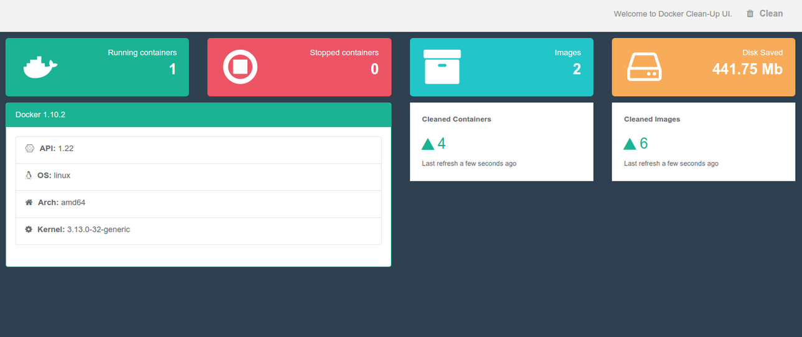

# Docker CleanUp

Clean up unused docker images and stopped containers.

# Quickstart

```sh
$ docker run -d -p 3000:3000 -v /var/run/docker.sock:/var/run/docker.sock --name docker-cleanup mlaouardy/docker-cleanup
```


